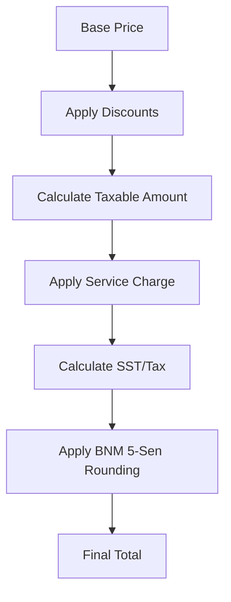

# Business Rules & Financial Integrity

## Financial Calculations (STRICT)
- **BigDecimal Only**: Never use `Float` or `Double` for currency or quantities.
- **Rounding Mode**: Always use `RoundingMode.HALF_EVEN` (Banker's Rounding) for all financial operations.
- **Scaling**: Standard currency scale is 2 decimal places. Unit rates (e.g., tax percentages) may use up to 4 decimal places.

## Malaysian BNM Rounding
Cash transactions must be rounded to the nearest 5 sen according to Bank Negara Malaysia (BNM) standards:
- **1, 2 sen**: Round down to 0.
- **3, 4 sen**: Round up to 5.
- **6, 7 sen**: Round down to 5.
- **8, 9 sen**: Round up to 10.

Implementation is centralized in `CurrencyUtils.calculateMalaysianRounding()`.

## Calculation Pipeline Visualization
All financial calculations must flow through this immutable pipeline to ensure consistency and auditability:

## Data Integrity & Immutability
- **Post-Transaction Immutability**: Financial values (prices, totals, tax amounts) MUST be immutable once a transaction is completed and saved to the database.
- **Audit Trails**: Any change to a "finalized" transaction (e.g., a void or return) must be recorded as a new, separate transaction or audit record, never by modifying the original record's financial fields.

## Inventory Integrity
- **Delta-Based**: Stock is calculated by summing `StockMovement` records.
- **Negative Stock**: Business configuration determines if selling below zero is allowed.
- **Audit Requirement**: Every stock adjustment must have a `reason` and `createdBy` staff ID.
